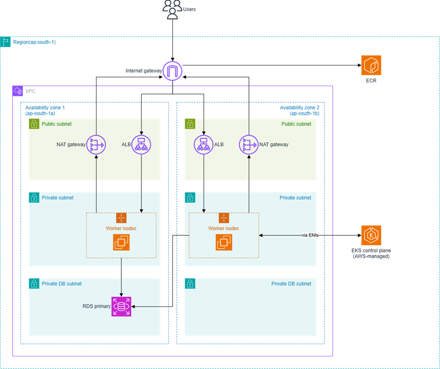

<div align="center">

# 🥗 Food Waste Management — Cloud-Native DevOps Project

**A production-style deployment pipeline for a full-stack web app on AWS**
*Docker · Terraform · GitHub Actions · Amazon ECR · Amazon EKS*


</div>

---

## 📖 Overview

This repository contains the deployment and DevOps layer for a **food waste management application**. It demonstrates how to take a multi-service web app from source code to a running, load-balanced workload on **Amazon EKS**, with infrastructure and delivery fully automated and repeatable.

**What this project covers**

- 🐳 Containerizing the frontend and backend services
- 🏗️ Provisioning AWS infrastructure with Terraform
- 🔄 Automating build, push, and deploy with GitHub Actions
- 📦 Storing images in a private Amazon ECR registry
- ☸️ Running workloads on Amazon EKS with rolling updates and health checks
- 🌐 Exposing the app through Kubernetes Ingress and the AWS Load Balancer Controller
- 🔐 Managing configuration and secrets outside the codebase

---

## 📑 Table of Contents

- [Architecture](#-architecture)
- [Tech Stack](#-tech-stack)
- [Prerequisites](#-prerequisites)
- [Infrastructure (Terraform)](#-infrastructure-terraform)
- [Kubernetes Deployment](#-kubernetes-deployment)
- [CI/CD Pipeline](#-cicd-pipeline)
- [Configuration](#-configuration)
- [Skills Demonstrated](#-skills-demonstrated)
- [Future Improvements](#-future-improvements)

---

## 🏛 Architecture

### AWS Infrastructure



The infrastructure is deployed in the **ap-south-1** region inside a single VPC spread across **two Availability Zones** (`ap-south-1a` and `ap-south-1b`).

| Layer | What runs there |
|---|---|
| **Public subnets** | Application Load Balancer (ALB) and NAT gateway in each AZ |
| **Private subnets** | EKS worker nodes running the frontend and backend pods |
| **Private DB subnets** | Amazon RDS (PostgreSQL), with no direct internet access |
| **Edge** | Internet gateway receives user traffic and forwards it to the ALBs |
| **Outbound access** | Worker nodes reach the internet (e.g. to pull images from ECR) through the NAT gateways |
| **Control plane** | AWS-managed EKS control plane, connected to worker nodes via ENIs |

**Traffic flow:** Users → Internet gateway → ALB (public subnet) → worker nodes (private subnet) → RDS (private DB subnet).

### Deployment Flow


| Step | What happens |
|---|---|
| 1 | A developer opens or updates a pull request on GitHub |
| 2 | The pull request triggers the GitHub Actions CI/CD workflow (`on: pull_request`; it can also be started manually with `workflow_dispatch`) |
| 3 | The pipeline builds and pushes the images to Amazon ECR using `docker compose build` and `docker compose push` |
| 4 | The pipeline runs `kubectl apply` / updates the deployments on the Amazon EKS cluster |
| 5 | EKS pulls the new images from ECR and performs a **rolling update** of the frontend and backend pods on the worker nodes |

---

## 🧰 Tech Stack

| Area | Tools |
|---|---|
| **Containers** | Docker, Docker Compose |
| **Orchestration** | Kubernetes, Amazon EKS, kubectl |
| **Registry** | Amazon ECR |
| **Database** | Amazon RDS (PostgreSQL) |
| **Networking** | AWS VPC, public/private subnets, Security Groups, ALB |
| **Infrastructure as Code** | Terraform |
| **CI/CD** | GitHub Actions |
| **Security** | AWS IAM, OIDC-based authentication |

---

## ✅ Prerequisites

- An AWS account with permissions to create VPC, EKS, RDS, ECR, and IAM resources
- [AWS CLI](https://aws.amazon.com/cli/) configured
- [Terraform](https://developer.hashicorp.com/terraform/downloads)
- [kubectl](https://kubernetes.io/docs/tasks/tools/)
- [Docker](https://docs.docker.com/get-docker/) and Docker Compose
- AWS Load Balancer Controller installed on the cluster (provisioned via Terraform in this project)

---

## 🏗 Infrastructure (Terraform)

All AWS resources are defined in the `terraform/` directory, making the environment reproducible from scratch.

| Component | Purpose |
|---|---|
| **VPC & networking** | Isolated network with public and private subnets |
| **Security groups** | Controlled traffic between ALB, nodes, and database |
| **EKS cluster + worker nodes** | Kubernetes control plane and compute |
| **IAM roles & policies** | Least-privilege access for cluster, nodes, and CI/CD |
| **Amazon RDS** | Managed PostgreSQL database layer |
| **ECR repositories** | Private registry for frontend and backend images |
| **ALB controller integration** | Lets Kubernetes Ingress provision AWS load balancers |

---

## ☸️ Kubernetes Deployment

Manifests live in `k8s/`:

| File | Description |
|---|---|
| `app-backend.yaml` | Backend Deployment and Service |
| `app-frontend.yaml` | Frontend Deployment and Service |
| `ingress.yaml` | ALB Ingress route for external access |

### Deploy

**1. Create the application ConfigMap**

```bash
kubectl create configmap app-config \
  --from-literal=SPRING_DATASOURCE_URL="jdbc:postgresql://<YOUR-RDS-ENDPOINT>:5432/food_waste_db?sslmode=require" \
  --from-literal=SPRING_JPA_SHOW_SQL="false" \
  --dry-run=client -o yaml | kubectl apply -f -
```

**2. Apply the manifests**

```bash
kubectl apply -f k8s/
```

### Verify

```bash
kubectl get pods
kubectl get svc
kubectl get ingress

kubectl rollout status deployment/frontend-deployment
kubectl rollout status deployment/backend-deploy
```

> 💡 The ALB address shown by `kubectl get ingress` can take a few minutes to become available.

---

## 🔄 CI/CD Pipeline

Defined in [`.github/workflows/deploy-eks.yaml`](.github/workflows/deploy-eks.yaml).

**Triggers**

- Manual run via `workflow_dispatch`
- Pull requests targeting `main`

**Stages**

| # | Stage | Details |
|---|---|---|
| 1 | **Checkout** | Pull the repository |
| 2 | **Set up toolchains** | Node.js and Java |
| 3 | **Build & verify** | Build artifacts and run verification steps |
| 4 | **Authenticate to AWS** | IAM role assumption via OIDC (no long-lived keys) |
| 5 | **Login to ECR** | Authenticate Docker to the private registry |
| 6 | **Build & push images** | Build Docker images and push to ECR |
| 7 | **Configure kubeconfig** | Connect to the EKS cluster |
| 8 | **Deploy** | Roll out new images using `kubectl set image` |
| 9 | **Verify rollout** | Confirm deployments are healthy |

**End-to-end flow**

1. Code is pushed to GitHub
2. GitHub Actions validates the build
3. Images are built and pushed to ECR
4. Terraform keeps the AWS infrastructure in the desired state
5. Kubernetes receives the new images via a rolling update
6. ALB Ingress routes traffic to the application
7. Rollout health is verified automatically

---

## 🎯 Skills Demonstrated

- ☁️ Cloud infrastructure automation
- 🔁 CI/CD pipeline design
- 📦 Containerization and container orchestration
- ☸️ Kubernetes deployment management
- 🔌 AWS service integration (EKS, ECR, RDS, VPC, IAM)
- 🔐 Secure, keyless CI/CD authentication with OIDC

---

## 🔮 Future Improvements

- Helm charts for application packaging
- Autoscaling for EKS workloads (HPA / Cluster Autoscaler)
- Monitoring with Prometheus and Grafana
- Centralized logging with CloudWatch or ELK
- Automated rollback strategies
- Secrets management with AWS Secrets Manager or Kubernetes Secrets
- Separate staging and production environments

---